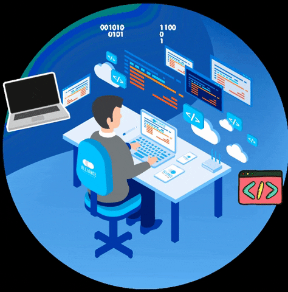

  <samp>
    <h1>Make Life Easier|Look through Lens|Entertain by GAMES</h1>
  </samp>

  <samp>
    <h2>Hi  I'm Daiyan Rahman</h2>

  </samp>

### Frontend Developer • Love to play GAMEAS • Photographer

*Currently coding modern user experiences and engineering electronics projects ✨*
*Still learn the Languages mentined  ✨*

---

<table align="center" width="100%">
  <tr>
    <td align="center" width="20%">
      
    </td>
    <td align="center" width="20%">
      
    </td>
    <td align="center" width="20%">
      
    </td>
    <td align="center" width="20%">
      
    </td>
    <td align="center" width="20%">
      
    </td>
  </tr>
</table>

##  About Me

- 🌐 **Frontend Developer:** I build clean, interactive, and user-friendly web applications.
- ⚡ **Hardware Enthusiast:** I love coding microcontrollers and building smart electronics projects with Arduino.
- 📸 **Photographer:** I capture the world through a lens and run my own brand, Daiyan Studio.
- 🎮 **Gamer & Explorer:** I enjoy playing classic games and learning new technologies.
- 🎯 **Goal:** I love combining software, hardware, and photography to bring creative ideas to life.

###  Tech Stack & Tools

---

### 🎨 Creative & Showcase

<table align="center" width="100%">
  <tr>
    <td align="center" width="50%">
      
    </td>
    <td align="center" width="50%">
      <video width="100%" autoplay loop >
        <source src="Black Illustrative Photography Logo.mp4" type="video/mp4">
        Your browser does not support the video tag.
      </video>
    </td>
  </tr>
</table>

---

 <h1> My projects</h1>

<h1>🛠️ Tech Stack & Tools (Frontend-Development)</h1>

<table align="center">
  <tr>
    <td align="center" width="120" height="120" bgcolor="#0d1117" style="border: 2px solid #3b82f6; border-radius: 8px; padding: 15px;">
       
      HTML5
    </td>
    <td align="center" width="120" height="120" bgcolor="#0d1117" style="border: 2px solid #3b82f6; border-radius: 8px; padding: 15px;">
       
      CSS3
    </td>
    <td align="center" width="120" height="120" bgcolor="#0d1117" style="border: 2px solid #3b82f6; border-radius: 8px; padding: 15px;">
       
      JavaScript
    </td>
    <td align="center" width="120" height="120" bgcolor="#0d1117" style="border: 2px solid #3b82f6; border-radius: 8px; padding: 15px;">
       
      Python
    </td>
    <td align="center" width="120" height="120" bgcolor="#0d1117" style="border: 2px solid #3b82f6; border-radius: 8px; padding: 15px;">
       
      Arduino
    </td>
  </tr>
  
  <tr>
    <td align="center" width="120" height="120" bgcolor="#0d1117" style="border: 2px solid #3b82f6; border-radius: 8px; padding: 15px;">
       
      Figma
    </td>
    <td align="center" width="120" height="120" bgcolor="#0d1117" style="border: 2px solid #3b82f6; border-radius: 8px; padding: 15px;">
       
      VS Code
    </td>
    <td align="center" width="120" height="120" bgcolor="#0d1117" style="border: 2px solid #3b82f6; border-radius: 8px; padding: 15px;">
       
      Git Bash
    </td>
    <td align="center" width="120" height="120" bgcolor="#0d1117" style="border: 2px solid #3b82f6; border-radius: 8px; padding: 15px;">
       
      GitHub
    </td>
    <td align="center" width="120" height="120" bgcolor="#0d1117" style="border: 2px solid #3b82f6; border-radius: 8px; padding: 15px;">
       
      Overleaf
    </td>
  </tr>

  <tr>
    <td align="center" width="120" height="120" bgcolor="#0d1117" style="border: 2px solid #3b82f6; border-radius: 8px; padding: 15px;">
       
      LaTeX
    </td>
    <td style="border: none;"></td>
    <td style="border: none;"></td>
    <td style="border: none;"></td>
    <td style="border: none;"></td>
  </tr>
</table>

## 🗃️ GitHub Activity

  <!-- GitHub Stats Card -->
  
  &nbsp;&nbsp;
  <!-- Most Used Languages Card -->
  

  <!-- Live Contribution Line Graph -->
  

## 🤝 Connect with me 

  <!-- Facebook Link -->
  
  &nbsp;&nbsp;&nbsp;&nbsp;
  <!-- Instagram Link -->
  
  &nbsp;&nbsp;&nbsp;&nbsp;
  <!-- Gmail Link -->
  

[def]: lack Illustrative Photography Logo.mp