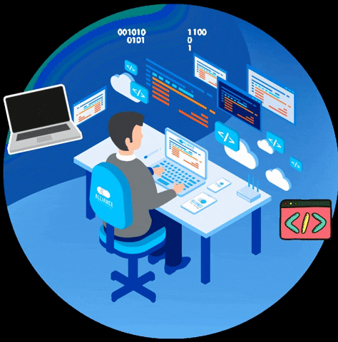

  <samp>
    <h1>Make Life Easier|Look through Lens|Entertain by GAMES</h1>
  </samp>

  <samp>
    <h2>Hi  I'm Daiyan Rahman</h2>

  </samp>

### Frontend Developer • Love to play GAMEAS • Photographer

*Currently coding modern user experiences and engineering electronics projects ✨*
*Still learn the Languages mentined  ✨*

---

<table align="center" width="100%">
  <tr>
    <td align="center" width="20%">
      
    </td>
    <td align="center" width="20%">
      
    </td>
    <td align="center" width="20%">
      
    </td>
    <td align="center" width="20%">
      
    </td>
    <td align="center" width="20%">
      
    </td>
  </tr>
</table>

##  About Me

- 🌐 **Frontend Developer:** I build clean, interactive, and user-friendly web applications.
- ⚡ **Hardware Enthusiast:** I love coding microcontrollers and building smart electronics projects with Arduino.
- 📸 **Photographer:** I capture the world through a lens and run my own brand, Daiyan Studio.
- 🎮 **Gamer & Explorer:** I enjoy playing classic games and learning new technologies.
- 🎯 **Goal:** I love combining software, hardware, and photography to bring creative ideas to life.

###  Tech Stack & Tools

---

### 🎨 Creative & Showcase

<table align="center" width="100%">
  <tr>
    <td align="center" width="50%">
      
    </td>
    <td align="center" width="50%">
      
    </td>
  </tr>
</table>

---

 <h1> My projects</h1>

 

<h1>🛠️ Tech Stack & Tools (Frontend-Development)</h1>

<table align="center">
  <tr>
    <td align="center" width="120" height="120" bgcolor="#0d1117" style="border: 2px solid #3b82f6; border-radius: 8px; padding: 15px;">
       
      HTML5
    </td>
    <td align="center" width="120" height="120" bgcolor="#0d1117" style="border: 2px solid #3b82f6; border-radius: 8px; padding: 15px;">
       
      CSS3
    </td>
    <td align="center" width="120" height="120" bgcolor="#0d1117" style="border: 2px solid #3b82f6; border-radius: 8px; padding: 15px;">
       
      JavaScript
    </td>
    <td align="center" width="120" height="120" bgcolor="#0d1117" style="border: 2px solid #3b82f6; border-radius: 8px; padding: 15px;">
       
      Python
    </td>
    <td align="center" width="120" height="120" bgcolor="#0d1117" style="border: 2px solid #3b82f6; border-radius: 8px; padding: 15px;">
       
      Arduino
    </td>
  </tr>
  
  <tr>
    <td align="center" width="120" height="120" bgcolor="#0d1117" style="border: 2px solid #3b82f6; border-radius: 8px; padding: 15px;">
       
      Figma
    </td>
    <td align="center" width="120" height="120" bgcolor="#0d1117" style="border: 2px solid #3b82f6; border-radius: 8px; padding: 15px;">
       
      VS Code
    </td>
    <td align="center" width="120" height="120" bgcolor="#0d1117" style="border: 2px solid #3b82f6; border-radius: 8px; padding: 15px;">
       
      Git Bash
    </td>
    <td align="center" width="120" height="120" bgcolor="#0d1117" style="border: 2px solid #3b82f6; border-radius: 8px; padding: 15px;">
       
      GitHub
    </td>
    <td align="center" width="120" height="120" bgcolor="#0d1117" style="border: 2px solid #3b82f6; border-radius: 8px; padding: 15px;">
       
      Overleaf
    </td>
  </tr>

  <tr>
    <td align="center" width="120" height="120" bgcolor="#0d1117" style="border: 2px solid #3b82f6; border-radius: 8px; padding: 15px;">
       
      LaTeX
    </td>
    <td style="border: none;"></td>
    <td style="border: none;"></td>
    <td style="border: none;"></td>
    <td style="border: none;"></td>
  </tr>
</table>

## 🗃️ GitHub Activity

  <!-- GitHub Stats Card -->
  <svg xmlns="http://www.w3.org/2000/svg" width="340" height="200" viewBox="0 0 340 200"><g class="gpsc-root"><rect x="1" y="1" rx="5" ry="5" height="99%" width="99.41176470588235%" stroke="#fdf6e3" stroke-width="1" fill="#fdf6e3" stroke-opacity="1"></rect><text x="30" y="40" class="gpsc-item" style="--gpsc-i: 0; font-size: 22px; fill: #268bd2;">Commits (UTC +8.00)</text><g transform="translate(0,40)"><g color="#859900" transform="translate(35,20)"><g color="#586e75" transform="translate(0,100)" fill="none" font-size="10" font-family="sans-serif" text-anchor="middle"><path class="domain" stroke="currentColor" d="M-1.1618257261410783,0.5H280.5"></path><g class="tick" opacity="1" transform="translate(6.3900414937759304,0)"><line stroke="currentColor" y2="6"></line><text fill="currentColor" y="9" dy="0.71em">0</text></g><g class="tick" opacity="1" transform="translate(76.09958506224066,0)"><line stroke="currentColor" y2="6"></line><text fill="currentColor" y="9" dy="0.71em">6</text></g><g class="tick" opacity="1" transform="translate(145.8091286307054,0)"><line stroke="currentColor" y2="6"></line><text fill="currentColor" y="9" dy="0.71em">12</text></g><g class="tick" opacity="1" transform="translate(215.51867219917014,0)"><line stroke="currentColor" y2="6"></line><text fill="currentColor" y="9" dy="0.71em">18</text></g><g class="tick" opacity="1" transform="translate(273.6099585062241,0)"><line stroke="currentColor" y2="6"></line><text fill="currentColor" y="9" dy="0.71em">23</text></g></g><g color="#586e75" transform="translate(-1.1618257261410783,0)" fill="none" font-size="10" font-family="sans-serif" text-anchor="end"><path class="domain" stroke="currentColor" d="M-6,100.5H0.5V0.5H-6"></path><g class="tick" opacity="1" transform="translate(0,100.5)"><line stroke="currentColor" x2="-6"></line><text fill="currentColor" x="-9" dy="0.32em">0</text></g><g class="tick" opacity="1" transform="translate(0,86.21428571428572)"><line stroke="currentColor" x2="-6"></line><text fill="currentColor" x="-9" dy="0.32em">5</text></g><g class="tick" opacity="1" transform="translate(0,71.92857142857143)"><line stroke="currentColor" x2="-6"></line><text fill="currentColor" x="-9" dy="0.32em">10</text></g><g class="tick" opacity="1" transform="translate(0,57.64285714285714)"><line stroke="currentColor" x2="-6"></line><text fill="currentColor" x="-9" dy="0.32em">15</text></g><g class="tick" opacity="1" transform="translate(0,43.35714285714286)"><line stroke="currentColor" x2="-6"></line><text fill="currentColor" x="-9" dy="0.32em">20</text></g><g class="tick" opacity="1" transform="translate(0,29.07142857142857)"><line stroke="currentColor" x2="-6"></line><text fill="currentColor" x="-9" dy="0.32em">25</text></g><g class="tick" opacity="1" transform="translate(0,14.78571428571429)"><line stroke="currentColor" x2="-6"></line><text fill="currentColor" x="-9" dy="0.32em">30</text></g><g class="tick" opacity="1" transform="translate(0,0.5)"><line stroke="currentColor" x2="-6"></line><text fill="currentColor" x="-9" dy="0.32em">35</text></g></g><rect class="bar" style="--gpsc-i: 0;" fill="#859900" x="1.1618257261410747" y="94.28571428571428" width="10.456431535269711" height="5.714285714285722"></rect><rect class="bar" style="--gpsc-i: 1;" fill="#859900" x="12.780082987551864" y="94.28571428571428" width="10.456431535269711" height="5.714285714285722"></rect><rect class="bar" style="--gpsc-i: 2;" fill="#859900" x="24.398340248962654" y="94.28571428571428" width="10.456431535269711" height="5.714285714285722"></rect><rect class="bar" style="--gpsc-i: 3;" fill="#859900" x="36.016597510373444" y="94.28571428571428" width="10.456431535269711" height="5.714285714285722"></rect><rect class="bar" style="--gpsc-i: 4;" fill="#859900" x="47.634854771784234" y="94.28571428571428" width="10.456431535269711" height="5.714285714285722"></rect><rect class="bar" style="--gpsc-i: 5;" fill="#859900" x="59.25311203319502" y="94.28571428571428" width="10.456431535269711" height="5.714285714285722"></rect><rect class="bar" style="--gpsc-i: 6;" fill="#859900" x="70.87136929460581" y="94.28571428571428" width="10.456431535269711" height="5.714285714285722"></rect><rect class="bar" style="--gpsc-i: 7;" fill="#859900" x="82.4896265560166" y="71.42857142857143" width="10.456431535269711" height="28.57142857142857"></rect><rect class="bar" style="--gpsc-i: 8;" fill="#859900" x="94.10788381742739" y="51.42857142857142" width="10.456431535269711" height="48.57142857142858"></rect><rect class="bar" style="--gpsc-i: 9;" fill="#859900" x="105.72614107883818" y="34.285714285714285" width="10.456431535269711" height="65.71428571428572"></rect><rect class="bar" style="--gpsc-i: 10;" fill="#859900" x="117.34439834024897" y="19.999999999999996" width="10.456431535269711" height="80"></rect><rect class="bar" style="--gpsc-i: 11;" fill="#859900" x="128.96265560165978" y="11.428571428571432" width="10.456431535269711" height="88.57142857142857"></rect><rect class="bar" style="--gpsc-i: 12;" fill="#859900" x="140.58091286307055" y="8.571428571428575" width="10.456431535269711" height="91.42857142857143"></rect><rect class="bar" style="--gpsc-i: 13;" fill="#859900" x="152.19917012448136" y="11.428571428571432" width="10.456431535269711" height="88.57142857142857"></rect><rect class="bar" style="--gpsc-i: 14;" fill="#859900" x="163.81742738589213" y="19.999999999999996" width="10.456431535269711" height="80"></rect><rect class="bar" style="--gpsc-i: 15;" fill="#859900" x="175.4356846473029" y="34.285714285714285" width="10.456431535269711" height="65.71428571428572"></rect><rect class="bar" style="--gpsc-i: 16;" fill="#859900" x="187.0539419087137" y="51.42857142857142" width="10.456431535269711" height="48.57142857142858"></rect><rect class="bar" style="--gpsc-i: 17;" fill="#859900" x="198.67219917012451" y="74.28571428571429" width="10.456431535269711" height="25.714285714285708"></rect><rect class="bar" style="--gpsc-i: 18;" fill="#859900" x="210.2904564315353" y="94.28571428571428" width="10.456431535269711" height="5.714285714285722"></rect><rect class="bar" style="--gpsc-i: 19;" fill="#859900" x="221.90871369294607" y="94.28571428571428" width="10.456431535269711" height="5.714285714285722"></rect><rect class="bar" style="--gpsc-i: 20;" fill="#859900" x="233.52697095435687" y="94.28571428571428" width="10.456431535269711" height="5.714285714285722"></rect><rect class="bar" style="--gpsc-i: 21;" fill="#859900" x="245.14522821576767" y="94.28571428571428" width="10.456431535269711" height="5.714285714285722"></rect><rect class="bar" style="--gpsc-i: 22;" fill="#859900" x="256.76348547717845" y="94.28571428571428" width="10.456431535269711" height="5.714285714285722"></rect><rect class="bar" style="--gpsc-i: 23;" fill="#859900" x="268.3817427385892" y="94.28571428571428" width="10.456431535269711" height="5.714285714285722"></rect><g><text y="130" x="220" style="fill: #586e75; font-size: 10px;">per day hour</text></g></g></g></g></svg>
  <!-- Most Used Languages Card -->
  

  <!-- Live Contribution Line Graph -->
  

## 🤝 Connect with me 

  <!-- Facebook Link -->
  
  &nbsp;&nbsp;&nbsp;&nbsp;
  <!-- Instagram Link -->
  
  &nbsp;&nbsp;&nbsp;&nbsp;
  <!-- Gmail Link -->
  

